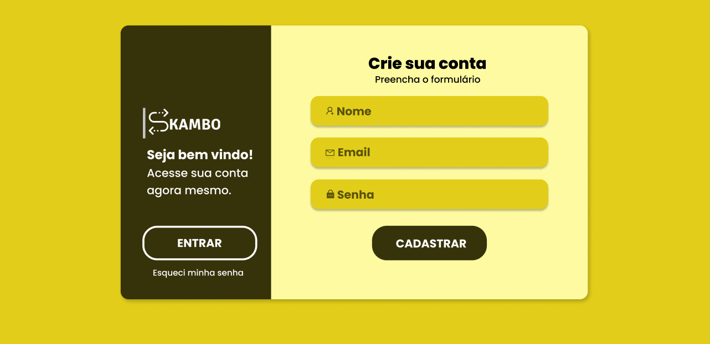

<h1 align="center"> Formulário  de registro Skambo </h1>

 

  

## 🚀 Tecnologias

Esse projeto foi desenvolvido com as seguintes tecnologias:

- HTML e CSS
- Git e Github
- Figma

## 💻 Projeto

O Formulário de registro  é uma criação de uma Landing-Page de formulário básic0 para aplicar o conhecimendos básicos de HTML e CSS.

## 🔖 Layout

Você pode visualizar o layout do projeto através [DESSE LINK](https://www.figma.com/file/NHa6M1pYwxYH6c2mfMsFZu/Formul%C3%A1rio-de-registro-(Community)?mode=dev). É necessário ter conta no [Figma](https://figma.com) para acessá-lo.

## :memo: Licença

Esse projeto está sob a licença Skambo.

---

Developed by Jeferson.
